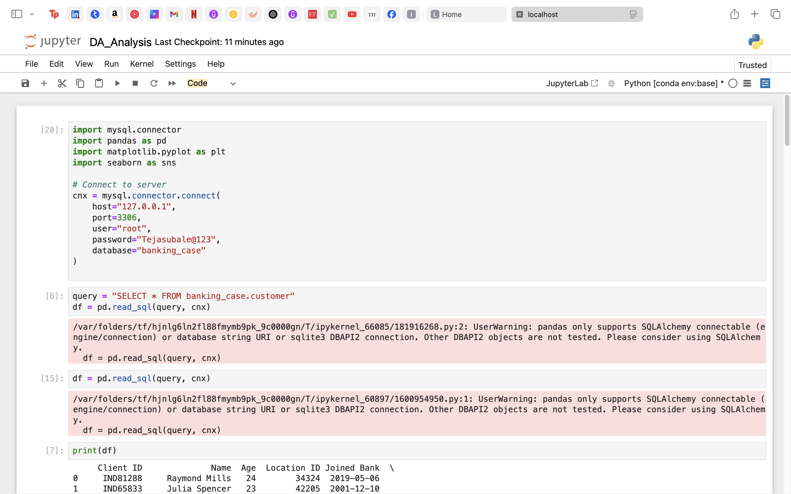
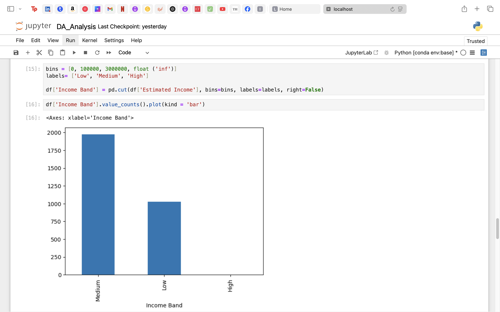
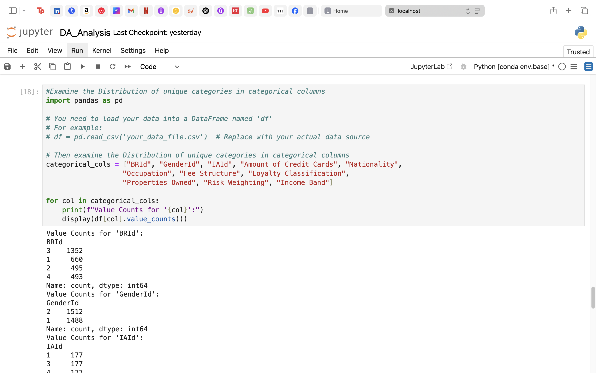
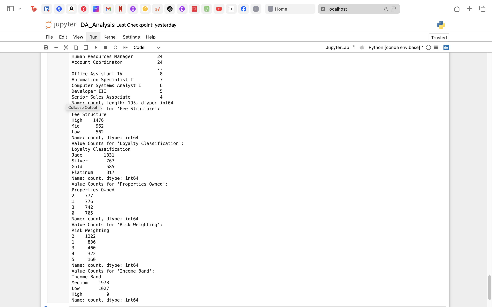
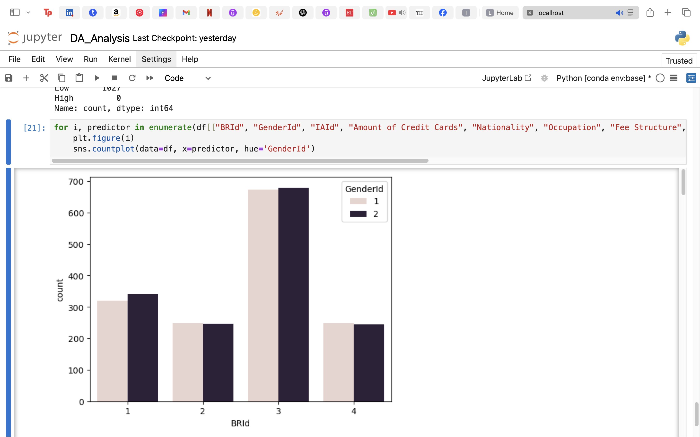
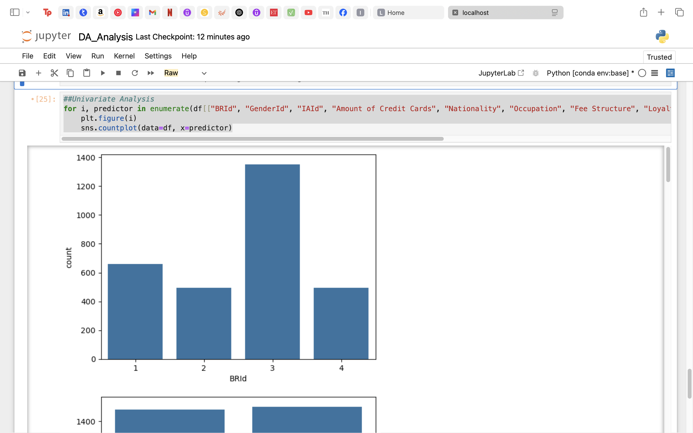
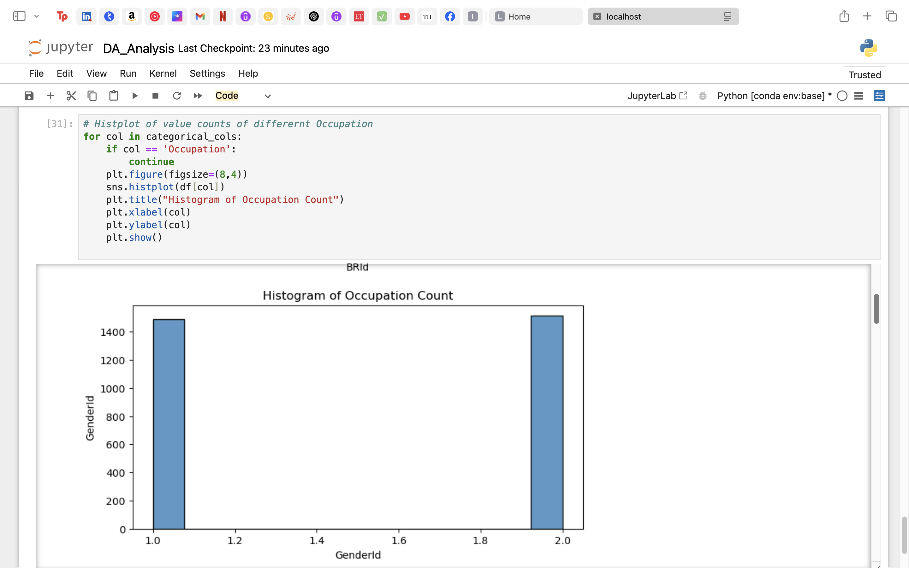
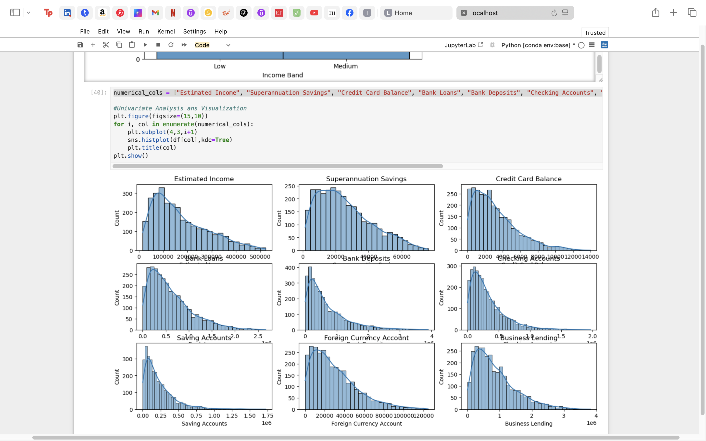
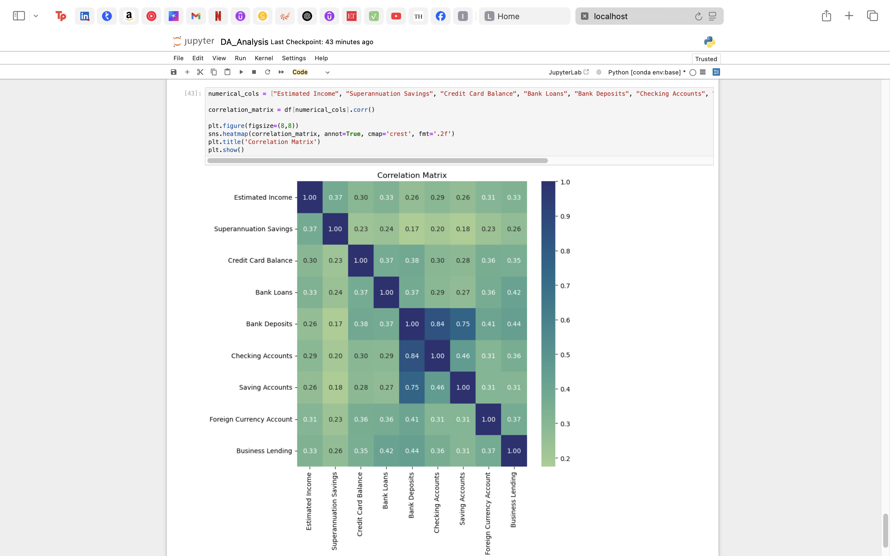

# 📊 Customer Banking Data Analysis

This project presents a comprehensive exploratory data analysis (EDA) of customer banking data from a fictional banking system. The goal of this analysis is to uncover key insights into customer profiles, financial behaviors, and potential risk factors using data visualization and statistical techniques.

---

## 📁 Dataset Overview

The analysis uses data sourced from a MySQL database named `banking_case`. The primary table analyzed is `customer`, which includes attributes like:

- Demographics: `Age`, `GenderId`, `Nationality`
- Financials: `Estimated Income`, `Bank Loans`, `Credit Card Balance`, `Bank Deposits`, `Saving Accounts`, etc.
- Behavior/Categoricals: `BRId`, `IAId`, `Fee Structure`, `Occupation`, `Loyalty Classification`, `Risk Weighting`, `Properties Owned`, etc.

---

## ⚙️ Technologies Used

- **Python 3**
- **JupyterLab**
- **Pandas, Numpy**
- **Seaborn, Matplotlib**
- **MySQL Connector**
- **SQLAlchemy (recommended for future integration)**

---

## 📌 Key Steps in the Analysis

### 1. **Database Connection**
- Established connection using `mysql.connector.connect()` to retrieve customer data from MySQL.
- **Note**: `pandas.read_sql()` was used with a warning — ideally use `SQLAlchemy` engine for compatibility.

### 2. **Data Cleaning & Exploration**
- Explored column types and distributions.
- Created **categorical frequency tables** (value counts) for BRId, GenderId, Occupation, Loyalty Classification, etc.
- Used `.cut()` to convert `Estimated Income` into Income Bands (Low, Medium, High).

### 3. **Univariate Analysis**
- Plotted bar plots and histograms for:
  - Categorical data: `BRId`, `GenderId`, `IAId`, `Nationality`, etc.
  - Numerical data: `Estimated Income`, `Superannuation Savings`, `Credit Card Balance`, etc.
- Identified imbalances like **no entries in the 'High' Income Band**.

### 4. **Bivariate Analysis**
- Used `sns.countplot()` with `hue='GenderId'` to compare distributions across genders.
- Created histograms and density plots for numerical comparisons.

### 5. **Correlation Analysis**
- Computed a **correlation matrix** across 10+ financial columns.
- Visualized with a `heatmap` to identify positive/negative correlations.
  - High correlation found between:
    - `Saving Accounts` & `Bank Deposits`
    - `Credit Card Balance` & `Bank Loans`

---

## 📈 Visual Highlights

- **Income Band Distribution** clearly shows dominance of 'Medium' income.
- **Occupation Count Histogram** highlights the most common job titles.
- **Gender vs BRId** plots show demographic variations across branches.
- **Correlation Heatmap** reveals relationships helpful for risk modeling or financial forecasting.

---

## ✅ Output Examples

- Clean, labeled plots and charts.
- Interactive category-wise visual breakdowns.
- Export-ready for reports or dashboards.

---

## 🔍 Future Improvements

- Integrate SQLAlchemy for stable database reading.
- Add outlier detection and feature engineering.
- Introduce clustering or classification models for segmentation.

---

## 📊 Tableau Dashboard

You can interact with the Tableau dashboard here:  
👉 [View Tableau Dashboard]([https://public.tableau.com/app/profile/yourusername/viz/your_dashboard_name](https://public.tableau.com/views/Banking_17502797323420/Dashboard1?:language=en-US&publish=yes&:sid=&:redirect=auth&:display_count=n&:origin=viz_share_link))

This dashboard provides visual insights related to the banking customer dataset used in this analysis.

---

## 📬 Contact

Project by **Tejas Ubale**  
If you have any questions or want to collaborate, feel free to reach out!
